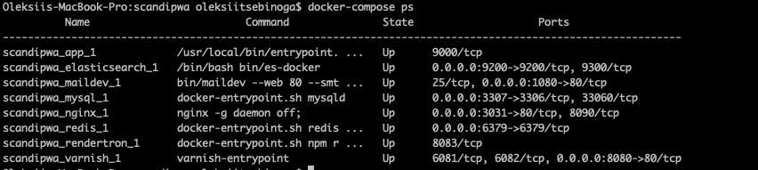
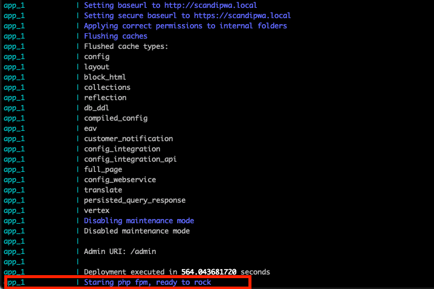

1.  Clone the repository
```console
git clone git@github.com:scandipwa/scandipwa-base.git
```

2. Now go into the folder with the repository downloaded
```console
cd scandipwa
```

3.  First, you will need to have the `COMPOSER_AUTH` set in your terminal as it will be used for Authentication during the Magento 2 installation.
You should set `COMPOSER_AUTH` on your machine (you can obtain credentials using [Magento2 Marketplace](https://account.magento.com/applications/customer/login/))

> This variable is required every time you are bringing an environment up, not only during the installation step

```console
export COMPOSER_AUTH='{"http-basic":{"repo.magento.com": {"username": "REPLACE_THIS", "password": "REPLACE_THIS"}}}'
```

4.  Generate selfsigned ssl certificates with (more details [here](docs/G-SSL-container.md) )
```console
make cert
```

5.  Pull all the containers for the environment
```console
docker-compose -f docker-compose.yml -f docker-compose.local.yml -f docker-compose.ssl.yml pull
``` 

6. Make the infrastructure run
```console
docker-compose -f docker-compose.yml -f docker-compose.local.yml -f docker-compose.ssl.yml up -d
```

7. Check the state of all the containers
```console
docker-compose ps
```

The output should show that all containers are up and be more or less similar to this (some containers could be named 
differently or added/removed) -



8. Now it is worth to mention that inside app container the installation of Magento will happen, which will
take time. So the environment will be ready only after fpm will become available.

You can easily track the progress by reading the logs of the application -
```console
docker-compose logs -f app
```

> Please note, that average time of running infrastructure up is about 600 seconds.
> So grab you tea and wait a bit =)

Your finish line of the installation will be gladly informing you that fpm is started and available for a incoming 
connections



At this moment your environment is running and Magento is available at *https://scandipwa.local*
<br>
<br>
<br>
<br>
If you can not be stopped and is willing to install ScandiPWA Demo store - [#followme further](/recipes/02-installing-scandipwa-demo.md);
<br>
<br>
<br>
<br>

